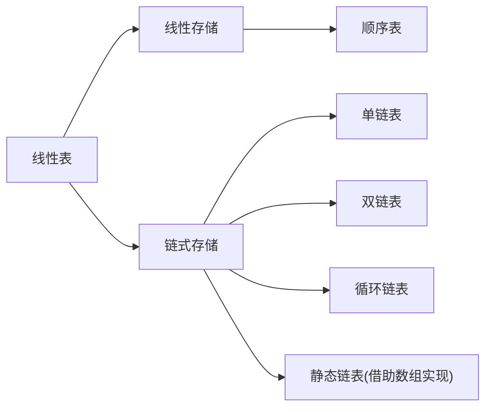

### 抽象数据类型(ADT)

抽象数据类型ADT(abstract data type)，一个实现包括存储数据元素的存储结构以及基本操作的算法集合，它是数学的抽象，在ADT的定义中，不包括具体的实现细节。

### 表ADT

##### 定义

一组数据类型相同的有限序列{$A_1, A_2, A_3 ,..., A_n$}，表的大小为n，当表大小为0时成为空表。除第一个元素外，每个元素有且仅有一个前驱，除最后一个元素外，每个元素有且仅有一个后继。

##### 分类

根据元素的存储方式可分为顺序表和链表两大类：

##### 顺序表

逻辑上相邻的两个元素，其物理存储也相邻，一般通过数组实现。

- 优点
  - 实现简单
  - 查找性能高，时间复杂度为O(1)
- 缺点
  - 插入、删除需要移动元素，时间复杂度为O(N)
  - 需要预分配存储空间，容易造成资源浪费和发生溢出错误
- 适用场景
  - 表大小确定
  - 查找操作频繁，插入、删除操作少

##### 链表

为了避免插入、删除的线性开销，就要避免插入、删除时的部分或整体移动，因此表元素之间不能连续存储，这种表就是链表，链表分单链表、双链表、循环链表等，下面先说说比较简单和常用的单链表。

在C语言的实现中，通过一个结构体来描述一个元素(节点)，包括一个数据域成员和一个指针成员，指针指向元素的后继 。该指针成员称Next指针或“链”，最后一个元素的Next指针指向NULL。

一个含有五个元素的单链表

指向第一个节点A1的指针叫头指针，我们通过头指针来命名链表。

因为元素不是连续存储的，元素之间的逻辑关联通过Next指针引用，因此插入元素时不需要把插入点后的元素整个后移，只需要修改插入点的指针引用关系即可：

上图中，在A2后插入元素X，只需要修改A2的Next指针指向新的节点，然后新的节点指向原A2的后继即可。

同样，对于删除操作，只需要将删除节点的前驱Next指针指向删除节点的后继即可：

如果要删除的是最后一个节点，只需要将前驱Next指针指向NULL即可，但是，这里有一个问题，就是当要删除的节点是第一个节点A1的时候会怎样？头指针的引用将会丢失，也就是表丢失了，同样如果在A1前插入元素也会造成表的丢失。

为了解决首节点删除和前插问题，一般实现中引入一个额外的节点，称为头节点或哑节点，它不包含数据域。头结点在位置0处，下面是一个带头结点的表：

引入头结点后，对A1节点的删除和前插操作和其它节点统一了，下面的实现采用头结点方案。